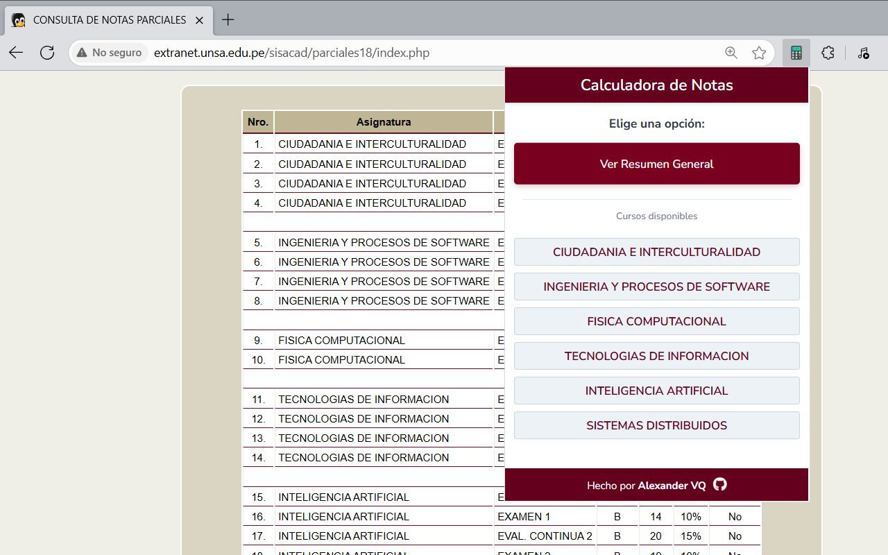
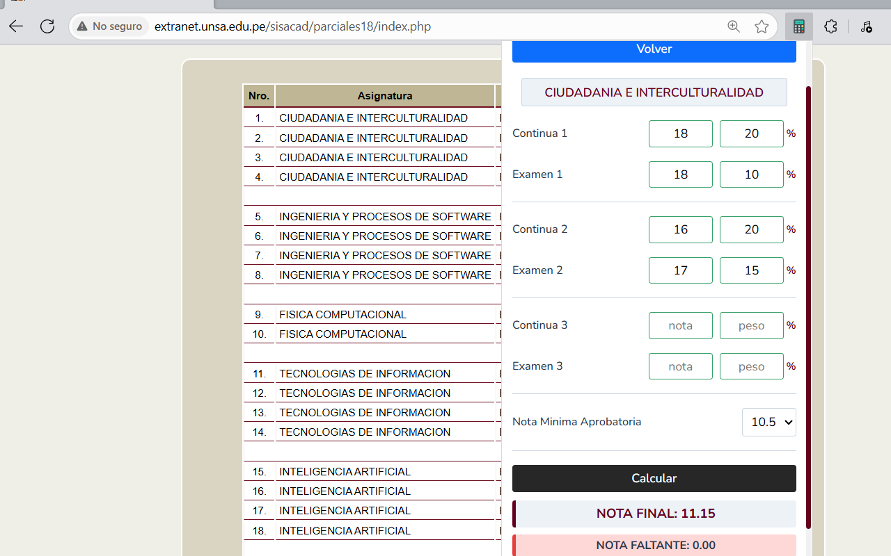
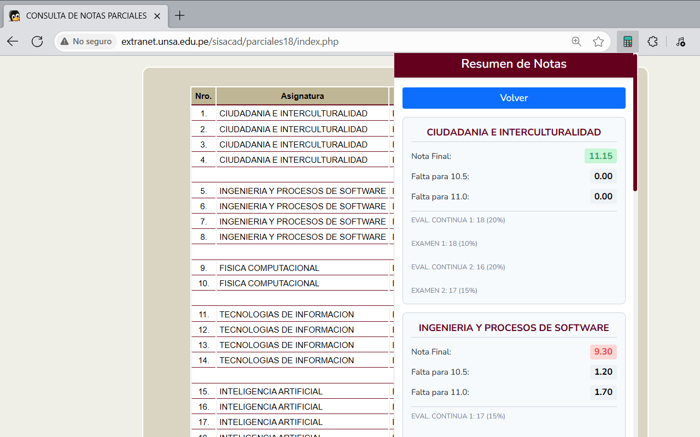

# Calculadora de Notas UNSA - Chrome Extension

Esta extensión de Chrome o navegadores basados en chromium permite a los estudiantes de la Universidad Nacional de San Agustín (UNSA) calcular sus notas parciales de forma rápida y sencilla.

## 🚀 Características
- **Extracción automática** de notas del sistema académico
- **Cálculo de notas parciales** por curso individual
- **Resumen general** de todos los cursos con notas finales
- **Cálculo de nota faltante** para aprobar (10.5 y 11.0)
- **Calculadora manual** para cursos sin datos automáticos
- **Interfaz intuitiva** y moderna
- **Soporte completo** para evaluaciones continuas y exámenes

## 📱 Capturas de Pantalla

### Vista Principal - Lista de Cursos
Interfaz principal mostrando la opción de resumen general y lista de cursos disponibles.

  

### Calculadora de Notas
Calculadora individual por curso con carga automática de notas y cálculos en tiempo real.

  

### Resumen General de Notas
Vista consolidada de todos los cursos con notas finales y faltantes para aprobar.

  

## 🔧 Instalación

### Desde Chrome Web Store (Recomendado)
1. Visita [Chrome Web Store - Calculadora de Notas UNSA] (https://chromewebstore.google.com/detail/calculadora-de-notas-unsa/pdgpmpobjpiinaieliceiacofpmnjoph)
2. Haz clic en "Agregar a Chrome"
3. Confirma la instalación

### Instalación Manual (Desarrolladores)
1. Descarga el código fuente desde GitHub
2. Abre Chrome y ve a `chrome://extensions/`
3. Activa el "Modo desarrollador"
4. Haz clic en "Cargar descomprimida"
5. Selecciona la carpeta del proyecto

## 💻 Uso

### Modo Automático
1. **Accede** al sistema académico de la UNSA
2. **Navega** a la sección de notas parciales
3. **Haz clic** en el icono de la extensión
4. **Selecciona** una opción:
   - **Ver Resumen General**: Vista de todos los cursos
   - **Curso individual**: Calculadora específica

### Modo Manual
1. **Haz clic** en "Calcular Notas Manualmente"
2. **Ingresa** las notas y pesos manualmente
3. **Calcula** para obtener resultados

## 👨‍💻 Desarrollador

**Creado por Alexander VQ**
- GitHub: [@avillaq](https://github.com/avillaq)
- Proyecto: [Calculadora de Notas UNSA](https://github.com/avillaq/CalculadoraNotasUNSA-ExtensionChrome)

## 📄 Licencia

Este proyecto está bajo la **Licencia MIT** - ver el archivo [LICENSE.md](LICENSE.md) para más detalles.
